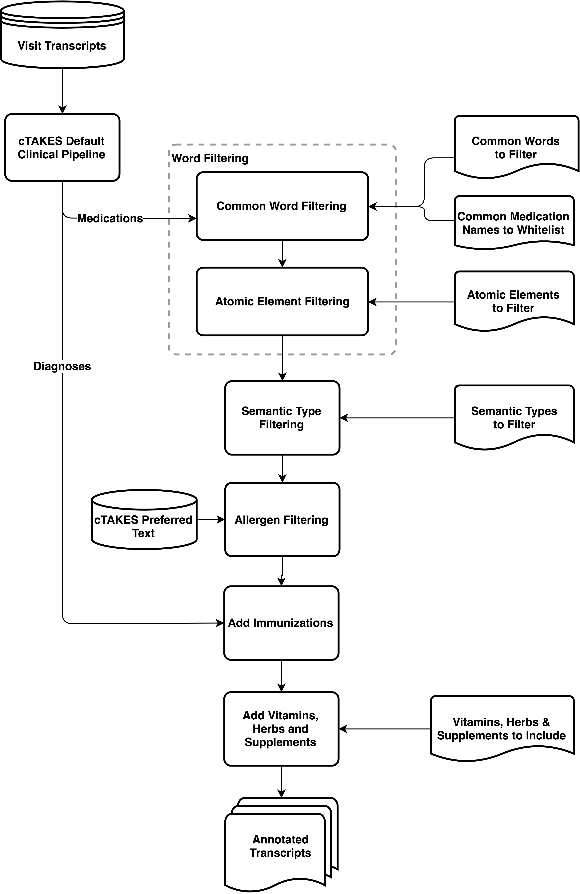

# Health Transcript Annotator: An annotator of mentions for important health-related items in patient-physician office visit transcripts

By Craig Ganoe and Saeed Hassanpour

## Dependencies
* [Java Development Kit 8 or newer](https://jdk.java.net/)
* [Gradle build tool](https://gradle.org/install/)
* [Apache cTAKES 4.0.0](https://ctakes.apache.org/)

_Also see dependencies in [build.gradle](./build.gradle)_

# Build and Installation
You will need to have a [Java Development Kit 8 or newer](https://jdk.java.net/) installed as well as the [Gradle build tool](https://gradle.org/install/).

Get a copy of the source code here. 

The software also uses a number of 3rd party libraries that are mostly integrated automatically by Gradle. The one exception is MedXN, which we use in comparisons, and there is code here to convert MedXN output to Knowtator format for comparisons. 

Add the MedXN library:
1. Create a "lib" folder in the root of the source tree if it is not already there.
2. Download MedXN-101.zip from [sourceforge](https://sourceforge.net/projects/ohnlp/files/MedXN/1.0.1/).
3. Unzip the MedXN-101.zip file you downloaded, and copy the MedXN-1.0.1.jar in the root folder of the zip file to the "lib" folder in the source code directory.

Use gradle to build a distribution of the Health Transcript Annotator:
`gradle assembleDist`
This will create a build in the "build" folder and a complete distribution in the "build/distributions" folder.

To use the distribution, unzip the zip file in the "distributions" folder to where you wish to install the distribution. The distribution includes:
- A "bin" folder with shell scripts to run the program.
- A "config" folder with configuration files.
- A "lib" folder with built jar files used by the program.

# Usage

## 1. Dataset
The Health Transcript Annotator (HTA) takes as input a directory of plain text files which each contain a transcript of a patient's visit with their physician.

## 2. cTAKES
The Health Transcript Annotator (HTA) uses Apache cTAKES as a preprocessor of the transcript files. cTAKES outputs data in an XML format (.xmi). 

Installation instructions available [here](https://cwiki.apache.org/confluence/display/CTAKES/cTAKES+4.0+User+Install+Guide).

HTA in our work uses the cTAKES [Default Clinincal Pipeline](https://cwiki.apache.org/confluence/display/CTAKES/Default+Clinical+Pipeline) for its preprocessing.

From an installed cTAKES, the Default Clinical Pipeline is invoked:

`bin/runClinicalPipeline  -i {inputDirectory}  --xmiOut {outputDirectory}  --user {umlsUsername}  --pass {umlsPassword}`

## 3. Health Transcript Annotator
The Health Transcript Annotator is a command line Java application which takes a folder of cTAKES output (CAS .XMI files) as its input (the inputDirectory below would be the outputDirectory of the cTAKES command in the above section).

If you have are in the root folder of a distribution built with gradle:

`./bin/HealthTranscriptAnnotator -e -d -c ./config -i {inputDirectory} -o {outputDirectory}`

### Parameters
| Param | Description |
| --- | ----------- |
| -d | Debug - annotates some items that are excluded with the reason as the annotation author |
| -e | Excludes - use the excludes files in the config folder; will get better results with this enabled |
| -c {configDirectory} | Directory containing the config files |
| -i {inputDirectory} | Directory containing the input CAS XMI files from cTAKES |
| -o {outputDirectory} | Directory to output annotated files in Knowtator format |

### Output
For each XMI file, an equivalent file is output in Knowtator format. For medications, the annotations are identified with the class "Discussion\_of\_Medications". The Health Transcript Annotator also identifies classes "Medical Condition", "Test & Imaging", and "Treatment & Procedure" (currently a work in progress).

## 4. Evaluation
### Dataset 
Transcripts of 85 patients visiting with their primary care physician were used as our dataset. These visits were audio recorded and transcribed by a HIPAA compliant commercial medical transcription service. Ten transcripts were randomly selected and used as a development set. Another ten of the  transcripts were randomly selected as a validation set for our model. The remaining 65 transcripts were held-out as a test set for evaluation.

We created a set of gold standard medication mention annotations in our dataset based on the work of expert annotators. All medication mentions in our evaluation set where the two expert annotators agreed were kept in this gold standard set. A physician, trained in the method used by the annotators, served as an adjudicator to resolve the disagreements between our annotators.

### Results

Using the gold standard 65 transcript evaluation set, we compared results from Health Transcript Annotator to the raw medication mentions from cTAKES using the same set of transcripts, as well as the medication name annotations of publicly available MedEx-UIMA 1.3.7 and MedXN 1.0.1 software.

|     Model           |     # True Positives    |     # False Positives    |     # False Negatives    |     Precision    |     Recall    |     F-Score    |
|---------------------|-------------------------|--------------------------|--------------------------|------------------|---------------|----------------|
|     cTAKES          |     1119                |     2814                 |     163                  |     28.5%        |   __87.3%__   |     42.9%      |
|     MedEx-UIMA      |     830                 |     1215                 |     292                  |     40.6%        |     74.0%     |     52.4%      |
|     MedXN           |     832                 |     318                  |     432                  |     72.3%        |     65.8%     |     68.9%      |
|     Our Approach    |     1062                |     168                  |     206                  |   __86.3%__      |     83.8%     |   __85.0%__    |
