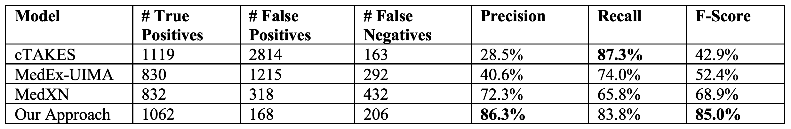

# Health Transcript Annotator: An annotator of mentions for important health-related items in patient-physician office visit transcripts

By Craig Ganoe and Saeed Hassanpour

## Dependencies
* [Java 7+](https://www.tensorflow.org/)
* [Apache cTAKES 4.0.0](https://ctakes.apache.org/)

# Usage

## 1. Dataset
The Health Transcript Annotator (HTA) takes as input a directory of plain text files which each contain a transcript of a patient's visit with their physician.

## 2. cTAKES
The Health Transcript Annotator (HTA) uses Apache cTAKES as a preprocessor of the transcript files. cTAKES outputs data in an XML format (.xmi). 

Installation instructions available [here](https://cwiki.apache.org/confluence/display/CTAKES/cTAKES+4.0+User+Install+Guide).

HTA in our work uses the cTAKES [Default Clinincal Pipeline](https://cwiki.apache.org/confluence/display/CTAKES/Default+Clinical+Pipeline) for its preprocessing.

From an installed cTAKES, the Default Clinical Pipeline is invoked:

`bin/runClinicalPipeline  -i {inputDirectory}  --xmiOut {outputDirectory}  --user {umlsUsername}  --pass {umlsPassword}`

## 3. Health Transcript Annotator
The Health Transcript Annotator is a command line Java application which takes a folder of cTAKES output (CAS .XMI files) as its input (the inputDirectory below would be the outputDirectory of the cTAKES command in the above section).

`java java edu.dartmouth.bmds.casxmi2knowtator.HealthTranscriptAnnotator -e -d -c {configDirectory} -i {inputDirectory} -o {outputDirectory}`

###Parameters
| Param | Description |
| --- | ----------- |
| -d | Debug - annotates some items that are excluded with the reason as the annotation author |
| -e | Excludes - use the excludes files in the config folder; will get better results with this enabled |
| -c {configDirectory} | Directory containing the config files |
| -i {inputDirectory} | Directory containing the input CAS XMI files from cTAKES |
| -o {outputDirectory} | Directory to output annotated files in Knowtator format |

## 4. Evaluation
### Dataset 
Transcripts of 85 patients visiting with their primary care physician were used as our dataset. These visits were audio recorded and transcribed by a HIPAA compliant commercial medical transcription service. Ten transcripts were randomly selected and used as a development set. Another ten of the  transcripts were randomly selected as a validation set for our model. The remaining 65 transcripts were held-out as a test set for evaluation.

### Results

